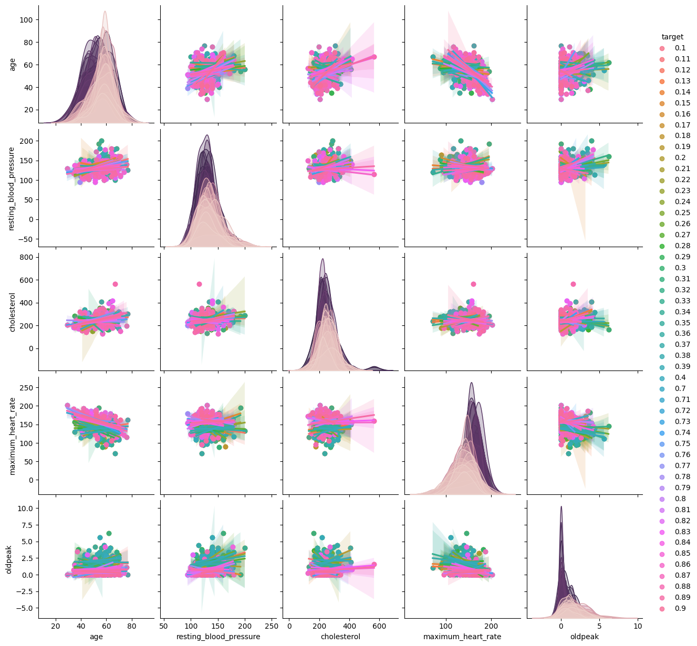

# Heart Attack Prediction

This repository contains code for predicting the likelihood of a heart attack based on various health parameters. It includes data preprocessing, exploratory data analysis (EDA), and model training using XGBoost and LightGBM.

## Data
The dataset used for this project is sourced from Kaggle and consists of 1025 entries with 14 features including age, sex, chest pain type, resting blood pressure, cholesterol level, and more.
### Top 5 Data from head
| age | sex | chest_pain | resting_blood_pressure | cholesterol | blood_sugar | restecg | maximum_heart_rate | exercise_induced_angina | oldpeak | st_slope | colored_by_fluoroscopy | thalassemia | target |
|-----|-----|------------|------------------------|-------------|-------------|---------|---------------------|-------------------------|---------|----------|-------------------------|-------------|--------|
| 52  | 1   | 0          | 125                    | 212         | 0           | 1       | 168                 | 0                       | 1.0     | 2        | 2                       | 3           | 0.23   |
| 53  | 1   | 0          | 140                    | 203         | 1           | 0       | 155                 | 1                       | 3.1     | 0        | 0                       | 3           | 0.37   |
| 70  | 1   | 0          | 145                    | 174         | 0           | 1       | 125                 | 1                       | 2.6     | 0        | 0                       | 3           | 0.24   |
| 61  | 1   | 0          | 148                    | 203         | 0           | 1       | 161                 | 0                       | 0.0     | 2        | 1                       | 3           | 0.28   |
| 62  | 0   | 0          | 138                    | 294         | 1           | 1       | 106                 | 0                       | 1.9     | 1        | 3                       | 2           | 0.21   |

### Summary Statistics
- The dataset contains 1025 entries and 14 features.
- There are no missing values in the dataset.
- 55 duplicate entries were identified and removed.
- The features include both numerical and categorical variables.

### Correlation Analysis
- Explored the correlation matrix to understand relationships between numerical features.
- Plotted heatmap to visualize the correlation coefficients between features.
- Identified correlations between certain features such as age, resting blood pressure, and cholesterol level.

## Exploratory Data Analysis (EDA)
- Explored the distribution of numerical features using histograms and box plots.
- Investigated relationships between numerical features and the target variable using pair plots.
- Analyzed categorical variables with bar plots to understand their impact on the target variable.
- Utilized box plots to visualize the distribution of categorical variables.

## Model Training

### Initially, I employ a regression model, followed by modifying the target variable to categorical and applying a classification model.
### XGBRegressor
- Trained an XGBoost regressor model with 10-fold cross-validation.
- Evaluated the model using mean absolute error (MAE) and plotted MAE over folds.

### XGBClassifier
- Transformed the target variable into binary classes (0 or 1) using a threshold of 0.5.
- Trained an XGBoost classifier model with 10-fold cross-validation.
- Evaluated the model using accuracy, F1 score, recall, specificity, sensitivity, and ROC AUC score.
- Plotted confusion matrices and accuracy over folds.

## Results
- The XGBRegressor achieved an average MAE of 0.2794 over 10 folds.

- The XGBClassifier achieved high accuracy and performance metrics, with an average accuracy of 0.9969, F1 score of 0.9965, and ROC AUC of 0.9973.

## Conclusion
Both XGBoost models showed promising results in predicting the likelihood of a heart attack based on the given health parameters. Further optimization and fine-tuning could potentially improve the models' performance.
